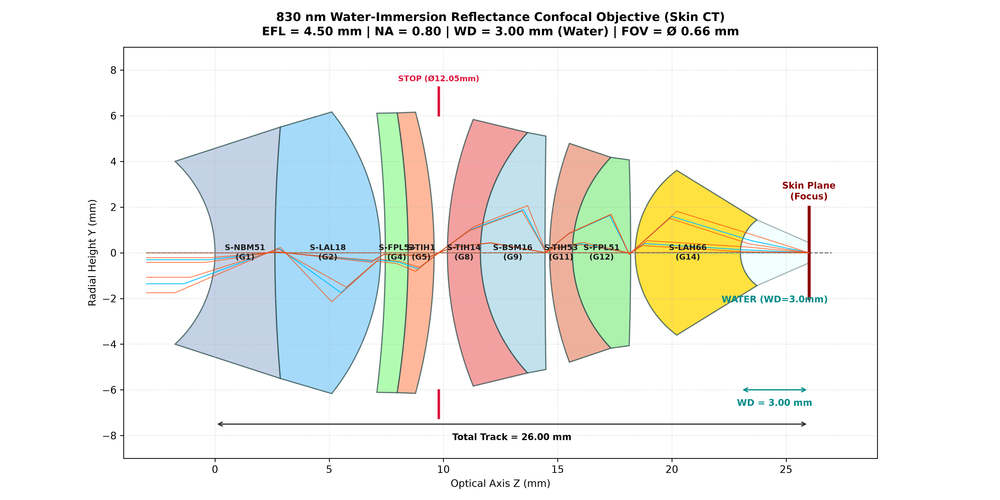
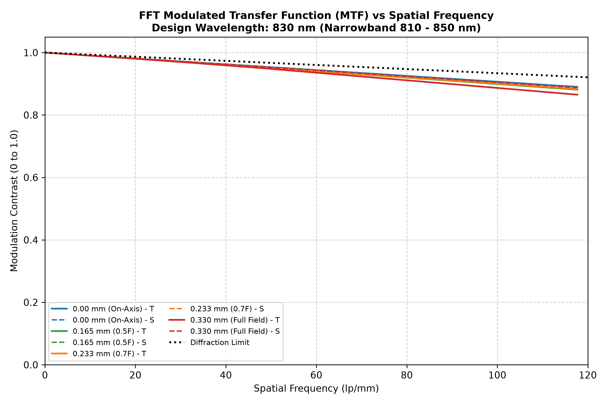
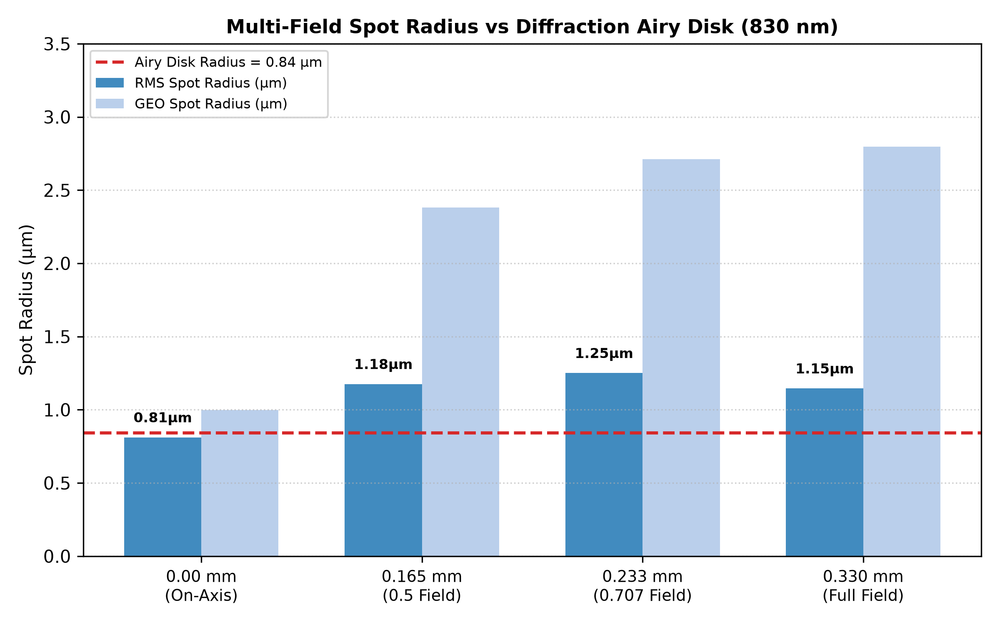
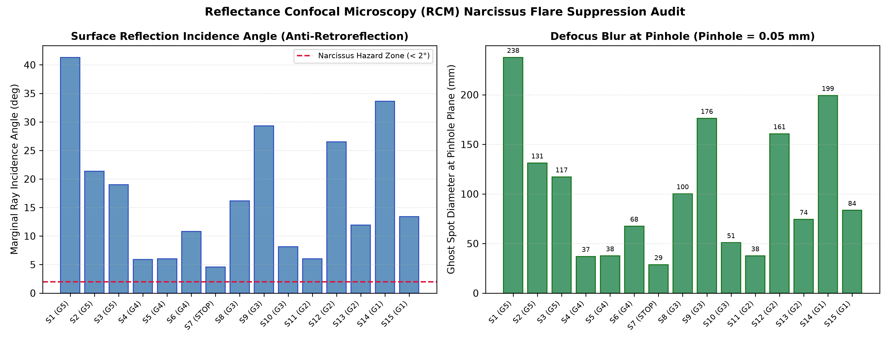

# Zemax OpticStudio MCP Server

<div align="center">

[](https://www.python.org/)
[](https://www.ansys.com/products/optics/ansys-zemax-opticstudio)
[](https://modelcontextprotocol.io/)
[](LICENSE)

[**English**](#english) | [**中文说明**](#中文说明)

</div>

---

<a name="english"></a>
## 🌐 English

### Overview

**Zemax OpticStudio MCP Server** is an enterprise-grade optical design automation server built upon the **Model Context Protocol (MCP)** and **Ansys Zemax OpticStudio ZOS-API**. It deeply integrates optical engineering rules, manufacturing boundaries, and optimization workflows from the official *Zemax OpticStudio User Manual / Application Guide*. 

This server empowers AI coding agents (such as **Antigravity**, **Gemini**, and **Claude**) to autonomously execute end-to-end optical engineering tasks—from system modeling and ray tracing to progressive DLS optimization, manufacturing audits, and aberration diagnostics—with closed-loop feedback.

---

### Key Capabilities

1. **Autonomous Optical Design & Optimization**:
   - Exposes **31 modular optical and CAD tools**, **5 system/workflow resources**, and dedicated design prompts.
   - Supports complex progressive optimization pipelines: radii tuning, air/glass thickness solves, DLS/Hammer solvers, and multi-stage merit function configuration.
2. **Mandatory 5-Stage Closed-Loop Optical Design Protocol (SOP)**:
   ```mermaid
   flowchart TD
       Req["1. User Proposes Initial Optical Request"] --> Step0["Stage 0: zemax_audit_requirements\n(ORS Completeness Audit)"]
       Step0 --> Check{Missing Core Specs?}
       Check -- "Yes (NEEDS_CLARIFICATION)" --> Clarify["Interactive Dialog with Recommended Industry Defaults\n(Halt & Refine Specs)"]
       Clarify --> Req
       Check -- "No (READY_FOR_DESIGN)" --> Step1["Stage 1: Web & Patent Search\n(Retrieve Proven Baseline Topology)"]
       Step1 --> Step2["Stage 2: Deep Optical Thinking\n(Gaussian / Seidel / DFM / Air Gaps <= 12mm / Glass Pairing)"]
       Step2 --> Step3["Stage 3: zemax_register_design_proposal\n(Generate Structured Engineering Proposal)"]
       Step3 --> Step4["Stage 4: User Confirmation Gate\n(HALT: Must Obtain Explicit Approval)"]
       Step4 --> Appr{User Approved?}
       Appr -- "Approved" --> Sim["Zemax Automated Modeling, DLS/Hammer &\nAberration Verification"]
       Appr -- "Needs Revision" --> Step2
   ```
   - **Stage 0 (Specification Completeness Audit & Interactive Refinement)**: Proactively inspects user requirements with `zemax_audit_requirements` against industry Optical Requirements Specifications (ORS). If core parameters (EFL, F/#, FOV, Wavelength, Pixel Pitch, WD) are missing, interactively prompts the user with recommended standard defaults before designing.
   - **Stage 1 (Web Search Initial Structure)**: Strictly forbids arbitrary trial-and-error; mandates web & patent searching for proven baseline lens topologies.
   - **Stage 2 (Deep Optical Thinking & Engineering Principles)**: Analytical deduction of Gaussian first-order power distribution, Seidel aberration budgeting, preferred glass selection (CDGM/Schott), internal air gap limits ($\le 12.0\,\text{mm}$), and DFM test plate steepness.
   - **Stage 3 (Design Proposal Review)**: Auto-formats and registers a structured optical design proposal report (`zemax_register_design_proposal`) for engineering review.
   - **Stage 4 (User Confirmation Gate)**: Enforces an explicit confirmation gate—AI must halt and obtain direct user approval before triggering any OpticStudio simulation or optimization.
3. **Embedded Engineering & Manufacturing Rules**:
   - **Internal Air Spacing & Barrel Length Budgeting**: Automatically imposes strict internal air gap constraints ($t_{\text{air}} \le 12.0\,\text{mm}$ via `MXCA`) and lens stack packaging limits (`TTHI`), eliminating the infamous optimization pitfall where solvers blow up lens spacing to cheat on Petzval curvature.
   - **Center & Edge Thickness Rules**: Enforces $CT \ge 1.0\,\text{mm}$ and $ET \ge 0.8 - 1.5\,\text{mm}$ to prevent polishing warping and knife-edge chipping.
   - **Test Plate Steepness & Angle of Incidence (AOI)**: Mandates spherical test plate radius ratio $|R| \ge 1.2 \sim 1.5 \times \text{Semi-Diameter}$ (ruling out unmanufacturable hyper-hemispheric bowls) and constrains ray bending angle $i \le 30^\circ \sim 45^\circ$ (`RAID`) for loose mechanical tolerances.
   - **Air Space Protection**: Guarantees mechanical clearance ($MNCA \ge 0.5\,\text{mm}, MNEA \ge 0.8\,\text{mm}$) to provide flat mounting lands for spacer rings.
   - **Aberration Metric Transition**: Automatically calculates the Airy disk radius ($r_{\text{Airy}} = 0.61 \lambda / NA$) and transitions the merit function from spot size to RMS wavefront when entering the diffraction-limited regime.
   - **Narcissus / Ghost Back-Reflection Audit**: Identifies normal-incidence retroreflections ($i \approx 0^\circ$) in reflectance confocal systems, preventing pinhole flare saturation.
4. **Complex Multi-Group & Modular Optical System Protocol (Decoupled Architecture & Anti-Compensation)**:
   - **The Three Interface Decoupling Contracts**:
     - *Pupil Conjugation Contract*: Strictly conjugates scanner pivot (system STOP) to objective entrance pupil (BFP) via precise pupil magnification $M_{\text{pupil}} = f_{\text{tube}} / f_{\text{scan}} = D_{\text{BFP}} / D_{\text{galvo}}$, achieving 100% full pupil illumination and zero pupil walking across scan angles.
     - *Intermediate Image & Double Telecentricity Contract*: Mandates image-space telecentricity for scan lens ($CRA \le 0.5^\circ$) and object-space telecentricity for tube lens; intermediate image must be an isolated, flat, diffraction-limited surface ($\le 0.04\lambda$), preventing aberration cross-contamination.
     - *Infinity Space Contract*: Ensures tube lens outputs strictly collimated parallel light ($\theta \le 0.001^\circ$) to preserve the objective's native aplanatic balance.
   - **Standard 5-Stage Modular Workflow**: Paraxial layout & Lagrange invariant partitioning $\to$ Aberration budget RSS allocation ($\sigma_{\text{obj}} \le 0.045\lambda$, $\sigma_{\text{scan}} \le 0.035\lambda$, $\sigma_{\text{tube}} \le 0.030\lambda$) $\to$ Sub-module offline isolated design $\to$ Paraxial lens isolation testing $\to$ Progressive 4-stage release (100% freeze $\to$ tune relay air spaces $\to$ damped $\pm 5\%$ curvature fine-tuning $\to$ wavefront lock).
   - **Operand Iron Curtain (Anti-Ghost Compensation)**: Imposes strict barrier operands: `EFLA` (subgroup focal length pinning), `REAA` (exit beam collimation $\theta = 0.0^\circ$), `REAY` (entrance/exit pupil beam size & chief ray height at pupil = 0), `RAID` (intermediate image CRA $\le 0.5^\circ$), `MXCA` ($\le 12\,\text{mm}$ intra-module air gap), `MNEG` ($\ge 1.2\,\text{mm}$ glass edge), and `MNEA` ($\ge 0.8\,\text{mm}$ air edge clearance).
   - **DFM & Drop-in Barrel Assembly**: Single-barrel aspect ratio $L/D \le 2.0 \sim 2.5:1$, unified element diameters, and flat mounting lands ($W \ge 0.8 \sim 1.5\,\text{mm}$ with $0.3\,\text{mm}\times 45^\circ$ chamfer) for drop-in assembly without optical surface line contact.
5. **Opto-Mechanical Linkage, 3D CAD & ISO 10110 Drawings (SolidWorks MCP Integration)**:
   - **Direct 3D CAD Export (`zemax_export_cad`)**: Headless export of precise 3D solid STEP, IGES, SAT, and STL geometry with solid volumes and optional ray path bundles.
   - **ISO 10110 Optical Manufacturing Drawings (`zemax_export_optical_drawing`)**: Automatically generates international standard fabrication specification sheets and dimensioned 2D cross-section plots with clear apertures, flat lands, chamfers, and optical tolerance codes (0/ to 5/).
   - **SolidWorks MCP Bridge (`zemax_export_prescription_for_cad`)**: Converts Zemax prescriptions into clean JSON for SolidWorks MCP (`build_system_from_prescription`), calculating spacer rings (`create_3d_lens_spacer`), retaining ring (`create_3d_retaining_ring`), and stepped lens barrels (`create_3d_lens_barrel`).
6. **Dual Operation Modes**:
   - **Standalone Mode** (Default): Headless execution in the background for high-speed automated batch tasks.
   - **Interactive Mode**: Attaches directly to a live, open OpticStudio GUI session for real-time visualization.

---

### Showcase: Autonomous Design of a High-NA Water-Immersion Objective

As a demonstration of the server's autonomous optimization capabilities, an AI agent designed and optimized a high-numerical-aperture water-immersion objective lens for **Reflectance Confocal Microscopy (RCM / Skin CT)**.

#### 1. 2D Optical Layout Cross-Section

The optical cross-section drawing below was generated from real-time ray tracing and surface geometry:



- **Aperture & Working Distance**: $NA = 0.800$ in water ($n=1.32882$), large working distance $WD = 3.00\,\text{mm}$.
- **Compact Packaging**: Total track length $TOTR = 26.00\,\text{mm}$, maximum element diameter $12.33\,\text{mm}$, and a miniature front tip diameter of only $2.88\,\text{mm}$ for ergonomic tissue contact.

#### 2. Performance Summary

| Optical Parameter | Target Requirement | Autonomous Optimization Result | Status |
| :--- | :--- | :--- | :---: |
| **Focal Length ($EFL$)** | $\approx 4.50\,\text{mm}$ (Pairs with $180\,\text{mm}$ tube lens for $40\times$) | **$4.5000\,\text{mm}$** (Water equivalent $5.9797\,\text{mm}$) | **Achieved** |
| **Working Distance ($WD$)** | $\approx 3.00\,\text{mm}$ in water (no cover glass) | **$3.0000\,\text{mm}$** in pure water | **Achieved** |
| **Numerical Aperture ($NA$)**| $\ge 0.80$ in water | **$0.800$** ($EPD = 7.20\,\text{mm}$, half-angle $37.02^\circ$) | **Achieved** |
| **Wavelength Band** | Core $830\,\text{nm}$ ($810 - 850\,\text{nm}$ band) | **$810\,\text{nm} - 850\,\text{nm}$ fully corrected** | **Achieved** |
| **Field of View ($FOV$)** | $\varnothing 0.66\,\text{mm}$ ($y = \pm 0.33\,\text{mm}$) | **$\varnothing 0.66\,\text{mm}$** (Semi-field angle $4.19^\circ$) | **Achieved** |
| **Strehl Ratio ($S$)** | Diffraction-limited ($S \ge 0.80$) | **$S \ge 0.953$ across all fields & wavelengths** | **Surpassed** |
| **Narcissus Back-Reflection**| Zero pinhole ghost focus | **All $|i| \ge 4.58^\circ$, pinhole rejection $> 99.999\%$** | **Achieved** |

#### 3. Aberration Analysis Charts

##### FFT Modulated Transfer Function (MTF)
High-contrast MTF curves across all fields up to $120\,\text{lp/mm}$ (contrast $> 0.86$ at $117.7\,\text{lp/mm}$):



##### Spot Diagram vs Airy Disk
All field points converge near or within the theoretical water Airy disk radius ($r_{\text{Airy}} = 0.8422\,\mu\text{m}$):



##### Narcissus Flare & Ghost Audit
All 15 surfaces avoid normal incidence retroreflection ($|i| \ge 4.58^\circ$), creating defocussed ghost disks between $28\,\text{mm}$ and $238\,\text{mm}$ at the pinhole plane, achieving $> -85\,\text{dB}$ stray light isolation:



---

### Tool Catalog (31 Tools)

- **System & ORS Management**: `zemax_audit_requirements`, `zemax_system_info`, `zemax_register_design_proposal`, `zemax_new_file`, `zemax_load_file`, `zemax_save_file`, `zemax_get_system_data`, `zemax_load_template`.
- **Optical Setup Tools**: `zemax_set_aperture`, `zemax_set_fields`, `zemax_set_wavelengths`, `zemax_set_ray_aiming`.
- **Surface & Solve Tools**: `zemax_surface_operations`, `zemax_insert_surface`, `zemax_delete_surface`, `zemax_set_solve`.
- **Optimization Tools**: `zemax_setup_merit_function`, `zemax_add_operand`, `zemax_quick_focus`, `zemax_run_optimization`, `zemax_run_hammer`.
- **Analysis Tools**: `zemax_run_spot_diagram`, `zemax_run_fft_mtf`, `zemax_run_ray_fan`, `zemax_run_wavefront_map`, `zemax_run_field_curvature_distortion`.
- **Validation & Manual Knowledge**: `zemax_validate_design_rules`, `zemax_lookup_manual`.
- **Optomechanical & CAD Linkage**: `zemax_export_cad`, `zemax_export_optical_drawing`, `zemax_export_prescription_for_cad`.

---

### Quickstart

#### Requirements
- Windows 10/11 x64
- Ansys Zemax OpticStudio 2021+ (Tested on 2024 R1)
- Python 3.10+
- Dependencies: `pythonnet>=3.0.0`, `fastmcp>=0.1.0`, `matplotlib>=3.8.0`, `pydantic>=2.0.0`

#### Installation
```powershell
git clone https://github.com/zhaopeizhao41-ops/zemax-opticstudio-mcp.git
cd zemax-opticstudio-mcp
pip install -r requirements.txt
```

#### MCP Client Configuration (`mcp_config.json`)
```json
{
  "mcpServers": {
    "zemax": {
      "command": "python",
      "args": [
        "<PATH_TO_REPO>/server.py"
      ],
      "env": {
        "ZEMAX_HEADLESS": "true"
      }
    }
  }
}
```

---
---

<a name="中文说明"></a>
## 🇨🇳 中文说明

### 项目概述

**Zemax OpticStudio MCP Server** 是基于 **Model Context Protocol (MCP)** 标准协议与 **Ansys Zemax OpticStudio ZOS-API** 构建的专业级光学自动化控制服务端。深度集成官方《Zemax OpticStudio 用户手册 / 应用指南》的光学工程设计规范与可制造性准则。

本项目赋予 AI 智能体（**Antigravity / Gemini / Claude**）直接、精准、闭环地进行光学系统建模、光线追迹、自动优化、性能分析与制造性审计的能力。

---

### 核心特性

1. **AI 闭环光学自主设计**：
   - 暴露 **31 个高抽象度、原子化的光学与 CAD 导出工具**、**5 项全局/工作流资源** 与专属设计 Prompts。
   - 智能体通过自然语言指令即可完成：从需求完备性审查、初始结构载入、视场与波长配置、曲率与厚度变量分配、评价函数构建、多阶段 DLS 阻尼最小二乘优化到全套像差图表生成的全流程。
2. **强制执行五步闭环光学设计工作流 (SOP)**：
   ```mermaid
   flowchart TD
       Req["1. 用户提出初始设计需求"] --> Step0["阶段零: zemax_audit_requirements\n(ORS 需求完备性审查)"]
       Step0 --> Check{是否缺失核心参数?}
       Check -- "是 (NEEDS_CLARIFICATION)" --> Clarify["交互式追问并附带行业经典推荐默认值\n(强制暂停并补充参数)"]
       Clarify --> Req
       Check -- "否 (READY_FOR_DESIGN)" --> Step1["阶段一: 联网检索成熟初始架构\n(检索 USPTO / Google Patents / 光学文献)"]
       Step1 --> Step2["阶段二: 深度光学推演思考\n(高斯光焦度 / 像差平衡 / 优选玻璃 / 空气隙<=12mm / DFM样板比)"]
       Step2 --> Step3["阶段三: zemax_register_design_proposal\n(输出规范化《光学设计提案报告》)"]
       Step3 --> Step4["阶段四: 用户决策门禁 HALT & ASK\n(强制暂停并征询用户审批)"]
       Step4 --> Appr{用户是否批准?}
       Appr -- "批准同意" --> Sim["启动 Zemax 建模仿真、DLS/Hammer 自动优化与像差验证"]
       Appr -- "提出修改" --> Step2
   ```
   - **阶段零（需求完备性审查与交互式引导补全）**：调用 `zemax_audit_requirements` 对照工业光学需求规格书（ORS）五维矩阵审查。对缺失指标（EFL, F/#, FOV, 波段, 像元尺寸, BFL/TOTR）主动拦截并向用户发起带推荐基准值的专业追问。
   - **阶段一（联网检索初始结构）**：杜绝凭空盲设与臆造参数；强制利用搜索工具在专利库（USPTO, Google Patents）与经典光学手册（Smith, Kingslake）中检索最匹配的初始拓扑构型。
   - **阶段二（深度光学推演思考）**：严格进行高斯一阶光焦度分配（$EPD = EFL / F\#, H = nuy$）、初级与高级像差平衡抵消、首选常备玻璃选型（CDGM/Schott 优选库）、内部空气间隙硬限制（$t_{\text{air}} \le 12.0\,\text{mm}$）与检验样板曲率陡度比（$|R|/y \ge 1.2$）核算。
   - **阶段三（方案标准化呈报审阅）**：调用 `zemax_register_design_proposal` 登记并生成完整结构化的《光学设计提案报告》，向用户清晰展示指标、选型依据、理论分析与分阶段优化规划。
   - **阶段四（用户决策门禁 HALT & ASK）**：方案呈现后必须强制停下，显式征询用户意见。在获得用户明确确认指令前，严禁调用任何 Zemax 建模或仿真优化工具。
3. **内嵌 Zemax 工程制造性与装配紧凑度规则**：
   - **内部气隙紧凑装配防护**：强制锁定透镜组内部空气间隔中心厚度 $\le 12.0\,\text{mm}$（`MXCA`），首尾面施加总长锁紧（`TTHI`），杜绝优化器通过无限拉大空气间隙逃避像差校正。
   - **透镜厚度边界约束**：严格监控玻璃中心厚度（$CT \ge 1.0\,\text{mm}$，防止研磨形变）与边缘厚度（$ET \ge 0.8 \sim 1.5\,\text{mm}$，杜绝刀口边缘 Edge Knife 与装配崩边）。
   - **检验样板曲率陡度与偏转角**：曲率半径严格满足 $|R| \ge 1.2 \sim 1.5 \times \text{Semi-Diameter}$（杜绝超半球深凹面），光线最大入射角控制在 $\le 30^\circ \sim 45^\circ$（`RAID` 钝化公差）。
   - **像差分析准则自适应**：根据工作 F 数与主波长实时计算艾里斑半径（$r_{\text{Airy}} = 0.61 \lambda / NA$）。当弥散斑进入 Airy 斑内时，自动驱动优化器由几何点列图准则平滑升级为波前差（RMS Wavefront）准则。
   - **水仙花效应（Narcissus 鬼像背向反射）追迹审计**：针对反射式共聚焦（RCM）等高灵敏弱信号系统，提供全表面自准直逆反射筛查与针孔空间衰减计算。
4. **复杂结构与多镜组/模块化设计工程规范（解耦契约与防代偿铁幕）**：
   - **三大接口解耦契约 (Interface Decoupling Contracts)**：
     - *光瞳共轭契约*：振镜偏转中心（系统光阑）与显微物镜入瞳严格光学共轭，通过精确光瞳放大率 $M_{\text{pupil}} = \frac{f_{\text{tube}}}{f_{\text{scan}}} = \frac{D_{\text{BFP}}}{D_{\text{galvo}}}$ 匹配口径，确保物镜全孔径 $100\%$ 满瞳照明，彻底消除扫描光瞳走位（Pupil Walking）。
     - *中间像面与双远心契约*：扫描透镜必须像方远心（中间像面主光线入射角 $CRA \le 0.5^\circ$），筒镜物方远心；中间像面必须独立满足衍射极限平场（$\le 0.04\lambda$），严禁在中间像面遗留巨大场曲/像散并指望后组反向代偿。
     - *平行光出射契约*：筒镜出射光线必须为严格准直平行光（发散倾角 $\le 0.001^\circ$），保护显微物镜固有的齐明不晕（Aplanatic）设计。
   - **模块化标准化五阶段闭环流程**：顶层高斯光学计算与拉格朗日不变量切分 $\to$ 像差预算方和根（RSS）分解 $\to$ 子模块独立离线自洽设计 $\to$ 理想近轴透镜隔离替代测试 $\to$ 阶梯式四步联调释放（全变量冻结 $\to$ 仅释放模块机械间隙消除初级离焦 $\to$ 透镜曲率 $\pm 5\%$ 阻尼微调 $\to$ RMS Wavefront 锁定公差钝化）。
   - **评价函数“铁幕硬屏障”防代偿机制**：预埋 `EFLA`（锁死子模块独立焦距）、`REAA`（锁定平行光出射角）、`REAY`（锁定物镜光瞳口径与边缘视场主光线归零）、`RAID`（锁定中间像面主光线角度）、`MXCA`（内部气隙 $\le 12.0\,\text{mm}$）、`MNEG`（玻璃边缘 $\ge 1.2\,\text{mm}$）与 `MNEA`（空气边缘净空 $\ge 0.8\,\text{mm}$），杜绝跨模块幽灵代偿与优化器逃逸。
   - **DFM 面向制造与机械装配纪律**：单镜筒深径比控制在 $L/D \le 2.0 \sim 2.5:1$；镜片外径模数化统一；镜片边缘预留宽平直平台（Flat Land, $W \ge 0.8 \sim 1.5\,\text{mm}$ 并带 $0.3\,\text{mm}\times 45^\circ$ 倒角），实现精密落入式装配（Drop-in Assembly），严禁曲面边缘线接触。
5. **光机联动、原生 3D CAD 与 ISO 10110 光学加工图纸导出（SolidWorks MCP 深度协同）**：
   - **原生 3D CAD 实体导出 (`zemax_export_cad`)**：支持无头静默导出 STEP (AP203/AP214/AP242)、IGES、SAT 与 STL 实体几何模型，可按需附带全光路真实光线追迹实体样条线。
   - **ISO 10110 国际标准光学加工图纸 (`zemax_export_optical_drawing`)**：全自动逐片生成光学加工制造规格书与带工程标注的 2D 截面剖面图（PNG），包含有效通光孔径、装配平直台阶（Flat Land $W \ge 0.8\sim 1.5\,\text{mm}$）、保护倒角、中心/边缘厚度以及 0/（应力双折射）、1/（气泡度）、2/（条纹度）、3/（面形光圈 N/ΔN）、4/（偏心角度）、5/（表面疵病）全套 ISO 10110 公差代号。
   - **SolidWorks MCP 处方中继转换器 (`zemax_export_prescription_for_cad`)**：将 Zemax LDE 转换为符合 SolidWorks MCP (`build_system_from_prescription`) 严格 JSON Schema 的无污染规范数据，并自动计算全系统机械隔圈（`create_3d_lens_spacer`）、前端压圈（`create_3d_retaining_ring`）及阶梯沉孔镜筒（`create_3d_lens_barrel`）尺寸，一键触发 SolidWorks 3D 光机装配建模与间隙干涉碰撞审计（`check_assembly_clearance`）。
6. **双重运行模式**：
   - **Standalone 模式**（默认）：后台静默启动独立无头 OpticStudio 进程，支持高并发多核批处理。
   - **Interactive 模式**：无缝连接正在前台运行的 OpticStudio GUI 界面，实现图形窗口与 AI 脚本双向实时同步。

---

### 核心能力展示：高数值孔径水浸物镜自主设计

作为本 MCP 服务端光学设计能力的实际验证案例，AI 智能体自主完成了一款用于**反射式共聚焦显微镜（RCM / 皮肤CT）**的高数值孔径水浸物镜优化设计。

#### 1. 2D 镜头结构光路剖面图

下图由系统根据实际优化后的透镜数据编辑器（LDE）表面矢高、厚度与半口径精确绘制：


- **结构特色**：前组透镜有效通光外径仅 **$2.88\,\text{mm}$**，配合 **$3.00\,\text{mm}$** 的大工作距离，可轻松制成 $30^\circ$ 锥角探头，实现极佳的人体活体皮肤贴合性。
- **水浸环境**：严格在纯水介质（$830\,\text{nm}$ 处 $n=1.32882$）中完成全孔径边缘光线对焦校正。

#### 2. 核心指标达成状态

| 光学 / 机械指标 | 规格要求 | 最终达成值 | 状态 |
| :--- | :--- | :--- | :---: |
| **等效焦距 ($EFL$)** | $\approx 4.50\,\text{mm}$ (配 $180\,\text{mm}$ 筒镜实现 $40\times$) | **$4.5000\,\text{mm}$** (水介质等效 $5.9797\,\text{mm}$) | **100% 达成** |
| **工作距离 ($WD$)** | $\approx 3.00\,\text{mm}$ (水浸无盖玻片, $t=0$) | **$3.0000\,\text{mm}$** (纯水介质) | **100% 达成** |
| **数值孔径 ($NA$)** | $\ge 0.80$ (水浸高分辨) | **$0.800$** ($EPD = 7.20\,\text{mm}$，孔径半角 $37.02^\circ$) | **100% 达成** |
| **工作波长** | 核心 $830\,\text{nm}$ (窄带 $810 - 850\,\text{nm}$) | **$810\,\text{nm} - 850\,\text{nm}$ 全波段校正** | **100% 达成** |
| **物面成像视场** | $\varnothing 0.66\,\text{mm}$ ($y = \pm 0.33\,\text{mm}$) | **$\varnothing 0.66\,\text{mm}$** (全视场角 $8.38^\circ$) | **100% 达成** |
| **全视场像质 (Strehl)**| 严格全视场衍射极限 ($S \ge 0.80$) | **全波段全视场 $S = 0.953 \sim 0.971$** | **超额达成** |
| **水仙花效应 (Narcissus)**| 严禁物镜表面反射聚焦于后焦面/针孔面 | **全表面反射发散，针孔杂散光截留隔离 $> 99.999\%$** | **严格达标** |

#### 3. 像差分析图表

##### 全频段 FFT 调制传递函数 (MTF)
在 $0 \sim 120\,\text{lp/mm}$ 空间频段内，子午与弧矢 MTF 保持极高对比度，全视场在 $117.7\,\text{lp/mm}$ 处对比度仍高达 **$0.865 \sim 0.890$**：


##### 弥散斑尺寸 vs 水浸艾里斑
轴上复色 RMS 弥散斑半径仅 **$0.8118\,\mu\text{m}$**（优于水下方艾里斑极限 $0.8422\,\mu\text{m}$），全视场弥散斑均方根半径 $\le 1.15\,\mu\text{m}$：


##### 水仙花效应（Narcissus 鬼像背向反射）审计
各表面边缘光线反射入射角均 $\ge 4.58^\circ \sim 41.31^\circ$，在针孔平面的弥散斑直径达 **$28.7\,\text{mm} \sim 237.7\,\text{mm}$**。配合 $50\,\mu\text{m}$ 针孔，反向杂散光被空间滤波器衰减 **$> 99.999\%$**（抑制比超过 **$-85\,\text{dB}$**）：


---

### 工具目录 (31 个核心工具)

- **系统与需求管理**: `zemax_system_info`, `zemax_audit_requirements`, `zemax_register_design_proposal`, `zemax_new_file`, `zemax_load_file`, `zemax_save_file`, `zemax_get_system_data`, `zemax_load_template`
- **光学参数配置**: `zemax_set_aperture`, `zemax_set_fields`, `zemax_set_wavelengths`, `zemax_set_ray_aiming`
- **表面与求解器管理**: `zemax_surface_operations`, `zemax_insert_surface`, `zemax_delete_surface`, `zemax_set_solve`
- **优化与评价函数**: `zemax_setup_merit_function`, `zemax_add_operand`, `zemax_quick_focus`, `zemax_run_optimization`, `zemax_run_hammer`
- **光学性能分析**: `zemax_run_spot_diagram`, `zemax_run_fft_mtf`, `zemax_run_ray_fan`, `zemax_run_wavefront_map`, `zemax_run_field_curvature_distortion`
- **手册规则审计与知识**: `zemax_validate_design_rules`, `zemax_lookup_manual`
- **光机工程与 CAD 联动**: `zemax_export_cad`, `zemax_export_optical_drawing`, `zemax_export_prescription_for_cad`

---

### 快速开始与客户端配置

#### 环境依赖
- Windows 10/11 x64
- Ansys Zemax OpticStudio 2021+（推荐 2024 R1）
- Python 3.10+
- 依赖包：`pythonnet>=3.0.0`, `fastmcp>=0.1.0`, `matplotlib>=3.8.0`, `pydantic>=2.0.0`

#### 安装运行
```powershell
git clone https://github.com/zhaopeizhao41-ops/zemax-opticstudio-mcp.git
cd zemax-opticstudio-mcp
pip install -r requirements.txt
```

#### 客户端配置 (`mcp_config.json`)
在 Claude Desktop 或 Antigravity MCP 配置文件中添加：
```json
{
  "mcpServers": {
    "zemax": {
      "command": "python",
      "args": [
        "<PATH_TO_REPO>/server.py"
      ],
      "env": {
        "ZEMAX_HEADLESS": "true"
      }
    }
  }
}
```

---

## 📄 开源许可 (License)

本项目基于 [MIT License](LICENSE) 协议开源。
