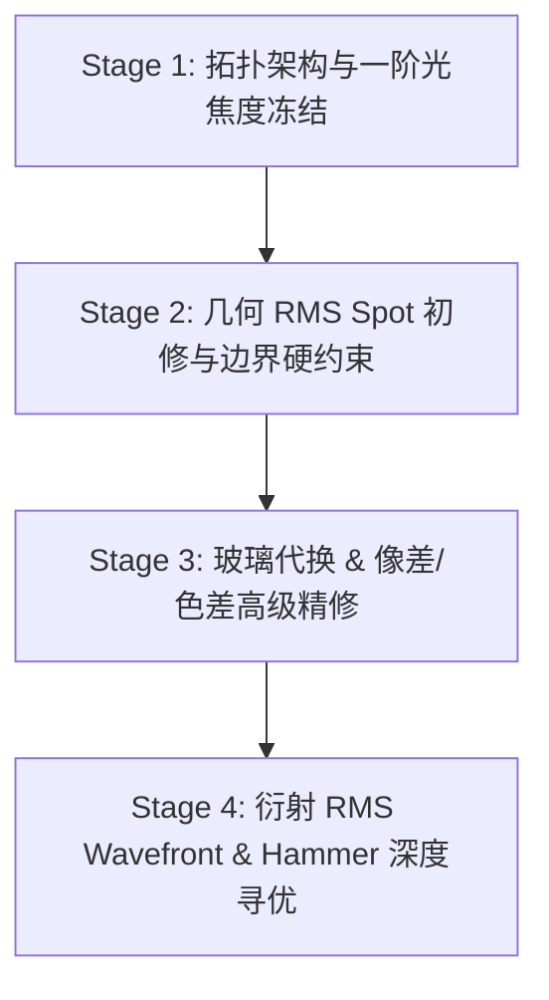

# 《光学设计专家工程手册：全生命周期设计、像差平衡与制造规程》
**Zemax OpticStudio Principal Optical Design & Engineering Manual**

---

## 0. 光学设计需求规格书 (ORS) 完备性审查与参数定义准则 (Requirements Specification Audit)

在开启任何光学设计之前，首要任务是**建立完备、无歧义的光学需求规格书（Optical Requirements Specification, ORS）**。
工业实践表明，80% 以上的光学设计返工或失败，根源都在于项目初期客户/用户遗漏了核心指标（如忘记给光圈、未定义传感器像元大小、忽略后截距或温度要求）。

### 0.1 需求五维盘点矩阵 (The 5-Dimension Audit Matrix)

| 维度 | 核心参数指标 | 为何不可或缺？(物理与工程原因) | 缺失时的追问话术与推荐默认值 |
| :--- | :--- | :--- | :--- |
| **1. 一阶成像特性** | **有效焦距 (EFL)** 或 **放大率 (M)** | 决定视场比例与物像共轭关系。 | *“请问期望的目标有效焦距（EFL）是多少毫米？”*（推荐默认：50 mm） |
| | **工作光圈数 (F/#)** 或 **数值孔径 (NA)** | 决定集光力、景深以及艾里斑极限尺寸（$r_{\text{Airy}} = 1.22 \lambda F/\#$）。 | *“请问光圈大小（F/#）是多少？”*（推荐默认：F/2.8） |
| | **视场角 (FOV)** 或 **像面圈直径** | 决定像差校正视场跨度及各视场主光线偏转力臂。 | *“搭配的传感器像面靶面多大或全视场角是多少？”*（推荐默认：2/3\" 靶面，对角线 11mm） |
| | **共轭状态** (无限远 / 有限远) | 决定光束入射形态（平行光入射 vs 点光源发散）。 | *“是物方无限远还是有限远物距？”*（推荐默认：无限远） |
| **2. 光谱与波长** | **工作波段 ($\lambda_{\min} \sim \lambda_{\max}$)** | 决定色差校正对（消初级色差）与是否需要 ED 反常色散玻璃。 | *“工作谱段是什么？”*（推荐默认：可见光 F-d-C 486.1~656.3nm） |
| | **主波长与参考权重** | 决定单色像差（球差/彗差）的基准优化波长。 | *“主工作波长是多少？”*（推荐默认：d 光 587.6 nm） |
| **3. 探测器接口** | **像元大小 (Pixel Pitch $p$)** | **极度关键！** 决定传感器 Nyquist 极限截止频率 $f_N = \frac{1000}{2p}\,\text{lp/mm}$，直接决定 MTF 考核指标（通常要求 $\text{MTF} \ge 0.2 \sim 0.3 @ f_N$）。 | *“传感器像元尺寸是多少微米？”*（推荐默认：3.45 μm，对应 $f_N = 145\,\text{lp/mm}$） |
| | **主光线入射角 (CRA) 匹配** | 防止传感器芯片微透镜边缘漏光、发暗（Shading）或像素串扰。 | *“传感器是否有 CRA 角度限制？”*（推荐默认：CRA $\le 15.0^\circ$ 或像方远心） |
| | **保护窗/滤光片厚度** | 聚光光束穿过平板玻璃会引入可观的正球差和轴向色差，大孔径下必须纳入优化。 | *“传感器前面是否有密封玻璃或红外截止滤光片？”*（推荐默认：1.0 mm N-BK7 等效片） |
| **4. 光机机械边界** | **最大光学总长 (TOTR)** | 限制镜头机械物理包络，杜绝系统无限伸展。 | *“是否有镜头最大总长限制？”*（推荐默认：$\le 1.5 \sim 2.0 \times \text{EFL}$） |
| | **最小后截距 (BFL) / 工作距 (WD)** | 保证机械接口螺纹（如 C 接口 17.526 mm）或物镜避免碰撞样品。 | *“最小后工作距或接口规范是什么？”*（推荐默认：$\ge 12.0\text{ mm}$） |
| | **最大机械外径 ($D_{\max}$)** | 避免与整机外壳或邻近镜头干涉。 | *“镜头外径是否有严格上限？”* |
| **5. 环境与公差** | **工作温度环境** | 决定是否需进行热差与无热化（Athermalization）联立方程求解。 | *“是室内常温还是宽温区环境？”*（推荐默认：常温 $20^\circ\text{C} \pm 5^\circ\text{C}$） |
| | **制造公差等级** | 决定公差钝化操作数（如 `RAID`）的压制力度。 | *“制造公差等级是什么？”*（推荐默认：商业级 Commercial / 精密级 Precision） |

### 0.2 智能体交互式追问标准话术模板
当审计发现缺失必填参数时，智能体**严禁擅自猜测**，必须以结构化列表向用户追问：
> “您好！为了为您设计出高像质、可精密装配的光学系统，我们需要明确以下关键参数指标。请您审阅并补充：
> 1. **有效焦距 (EFL)**：例如 50 mm *(推荐默认)*
> 2. **工作光圈 (F/#)**：例如 F/2.8 *(推荐默认)*
> 3. **传感器靶面 / 视场角 (FOV)**：例如 2/3\" 靶面（对角线 11 mm） *(推荐默认)*
> 4. **工作波段**：例如 可见光 400~700 nm *(推荐默认)*
> 5. **像元尺寸 (Pixel Pitch)**：例如 3.45 μm（对应 Nyquist 频率 145 lp/mm） *(推荐默认)*
> 
> *提示：若您对某项指标无特殊限定，可以直接回复'按推荐默认值'，我们将采用上述行业通用基准启动设计方案制定。*”

---

## 1. 经典光学架构拓扑选型树 (Starting Topology Selection Tree)

光学设计的首要原则是：**永远不要从零或随意猜测的单片透镜开始**，必须基于一阶光学参数（焦距 $f$、相对孔径 $D/f$ 或 F/#、视场角 $2\omega$ 或 FOV、工作谱段 $\lambda$）在经典成熟架构树中定位最优拓扑起点：

```
                    ┌─────────────────────────┐
                    │  系统规格指标输入       │
                    │  EFL, F/#, FOV, 谱段    │
                    └────────────┬────────────┘
                                 │
         ┌───────────────────────┴───────────────────────┐
         ▼                                               ▼
   【大孔径/小中视场】                              【大视场/广角】
(F/# ≤ 2.8, FOV ≤ 30°)                         (FOV ≥ 40° ~ 120°)
         │                                               │
   ┌─────┴──────────────┐                         ┌──────┴──────────────┐
   ▼                    ▼                         ▼                     ▼
双高斯 (Double Gauss)  珀兹伐 (Petzval)        反远摄 (Retrofocus)   对称广角 (Biogon/Topogon)
- F/1.4 ~ F/2.8        - F/1.2 ~ F/2.0         - 后截距 BFL > EFL    - 极低畸变
- 对称消彗差/畸变      - 长焦高速物镜          - 前负后正结构        - 前后对称弯月组
- 视场 20° ~ 30°       - 平场需后置平场镜      - 车载/安防/手机镜头   - 航测/机器视觉

         ┌───────────────────────────────────────────────┐
         ▼                                               ▼
   【中等视场与孔径】                              【专用工业/仪器光学】
(F/# 3.5~5.6, FOV 30°~50°)                               │
         │                                        ┌──────┴──────────────┐
   ┌─────┴──────────────┐                         ▼                     ▼
库克三片 (Cooke Triplet)天塞 (Tessar)          F-Theta 扫描透镜     显微筒镜/物镜 (Tube/Obj)
- 正-负-正基本型       - 后组胶合双胶          - 像方远心设计        - 无限远共轭系统
- 自由度刚好平衡初级   - 大幅提升轴上球色差    - 产生负桶畸 y=f*θ    - 严格平场+宽带消色差
- 紧凑、低成本         - 工业检测/标准镜头     - 激光振镜扫描物镜    - 荧光/双光子显微成像
```

### 1.1 光阑 (Stop) 位置的物理决定逻辑
1. **Bow-Sutton 对称性原理**：
   - 当系统关于中央光阑呈完全或准结构对称时（如双高斯、对称双微透镜、对称广角），所有**奇数阶像差（彗差 $W_{131}$、畸变 $W_{311}$、横向垂轴色差 Lateral Color）天然自动相互抵消为零**。
   - 凡对畸变和彗差有极其严苛要求的成像系统，应优先选用关于光阑对称的拓扑构型。
2. **光瞳匹配与出瞳距要求**：
   - 投影物镜、显微目镜：出瞳必须位于镜头外部后方指定距离（Eye Relief $\ge 15\sim 20\text{ mm}$），迫使光阑前移或设置中间中继瞳孔。
   - 图像传感器匹配（CRA 限制）：现代 CMOS 芯片主光线入射角（CRA）通常限制在 $< 15^\circ$ 或 $< 25^\circ$，超大广角必须后移光阑或采用像方远心光路，避免边缘像素严重暗角或比对串色。
3. **远心系统 (Telecentric Systems)**：
   - 物方远心：光阑置于后焦面上；像方远心：光阑置于前焦面上（如 F-Theta 扫描镜头置于振镜转轴处）；双远心：共用中间焦点光阑。

---

## 2. 透镜间空气间隔物理机理与紧凑装配规范 (Air Space & Compactness)

在 Zemax 阻尼最小二乘法（DLS）或正交下降（OD）优化过程中，如果未对镜片厚度施加硬性权重惩罚，优化器经常会将透镜之间的空气厚度推至数十毫米甚至 80~100 mm。这并非算法缺陷，而是数学优化器在缺乏光机边界约束时，逃避高难度像差平衡的“物理捷径”：

### 2.1 利用大间距消除 Petzval 场曲 (Breaking Petzval Sum with Distance)
根据薄透镜三阶 Petzval 像差公式：
$$P = \sum_{i} \frac{\phi_i}{n_i} = \frac{\phi_1}{n_1} + \frac{\phi_2}{n_2}$$
在紧密接触系统（$d \approx 0$）中，若要实现像面平坦（$P \to 0$），负透镜光焦度 $\phi_1$ 必须在数值上平衡正透镜 $\phi_2$，但这会导致系统总汇聚光焦度 $\Phi = \phi_1 + \phi_2$ 严重削弱，甚至无法对焦。

然而，当正负透镜组被较长的空气间隔 $d$ 分离时，组合光焦度公式变为：
$$\Phi = \phi_1 + \phi_2 - d \cdot \phi_1 \cdot \phi_2$$
- 前组负透镜可赋予极强的负光焦度（$\phi_1 \ll 0$），产生巨大的**负 Petzval 贡献**；
- 边缘光线经过前负组发散后，在超长空气间隔 $d$ 内传播，到达后组正透镜时的光线高度 $y_2$ 大幅抬升；
- 后组正透镜只需相对平缓的曲率（中等偏小的 $\phi_2 > 0$），即可将发散光束汇聚并达到系统所需的焦距；
- **优化器的偷懒路径**：拉长空气间隔 $d$，无需采用昂贵的高折射率特殊玻璃或复杂的透镜弯曲（Bending），即可在不损失系统总光焦度的前提下彻底消除 Petzval 场曲。

### 2.2 规避陡峭曲率引发的高级球差 (High-Order Aberration Evasion)
- 透镜三阶球差正比于光线孔径角和表面偏转角：$W_{040} \propto y^4 \phi^3$。
- 在紧凑镜头中，单个透镜承担的光折射角度大，曲率半径极小（陡面）。光线在折射界面入射角 $i$ 较大时，Snell 定律非线性项会激发极其严重的 5 阶和 7 阶高级球差。
- 当透镜间距拉开后，光线传播空间充裕，优化器可以利用长行程平缓弯折光线，将各透镜表面的偏转角减到最小，从而轻松避开高级像差。

### 2.3 利用光阑移动效应 (Stop Shift Leverage) 操控离轴像差与畸变
离轴像差（彗差、像散、畸变）高度取决于主光线高度 $\bar{y}$。间隙 $d$ 使得主光线在后组透镜上产生显著的偏轴投影高度：
$$\Delta \bar{y} = d \cdot \bar{u}$$
- 在 **F-Theta 扫描透镜**中，系统必须产生精准的桶形负畸变（像高满足 $y' = f \theta$ 而非 $y' = f \tan\theta$）。超长空气隙为优化器提供了巨大的光臂杠杆，使其能够仅凭极平缓的球面后组透镜自由合成该负畸变。
- 在远心系统中，全视场主光线在像面垂直入射（$\text{CRA} \le 1.0^\circ$）。若后组透镜距离主光阑过近，必须具备极大的偏转力；拉大空气间隔相当于放大了光学杠杆，使远心校正变得极其容易。

### 2.4 工业制造与机械装配边界 (Optomechanical Manufacturing Realities)
1. **偏心与倾斜敏感度的力臂放大效应 (Lever Arm Effect)**：
   镜片在镜筒内的机加工倾斜误差 $\theta_{\text{tilt}}$ 会随空气间隔 $d$ 线性放大为横向光轴位移：
   $$\delta = d \cdot \theta_{\text{tilt}}$$
   若 $d = 80\text{ mm}$，仅 1 弧分（约 0.3 mrad）的装配倾斜就会在下一透镜表面产生高达 **$24\,\mu\text{m}$** 的横向离轴，导致灾难性的像散非对称性与视场倾斜；若控制在 $d \le 8\text{ mm}$，离轴量仅 **$2.4\,\mu\text{m}$**，完全落在常规制造容差内。
2. **镜筒长径比与加工刚度失衡**：
   镜筒深孔单点车削的深径比应控制在 $L / D \le 2.5:1$。过长的镜筒会导致车刀杆刚度不足产生颤振，内孔两端各镜座同轴度无法保证达到 $< 3\,\mu\text{m}$。
3. **环境温度失焦 (Thermal Defocus)**：
   铝合金镜筒（$\text{CTE} \approx 23 \times 10^{-6}/\text{K}$）与玻璃（$\text{CTE} \approx 5 \sim 9 \times 10^{-6}/\text{K}$）存在巨大线膨胀失配。超长空气隙由长段铝材支撑，温变 $\Delta T$ 时轴向尺寸漂移巨大：$\Delta d = d \cdot \alpha_{\text{barrel}} \cdot \Delta T$，导致严重的离焦热漂移。
4. **后组口径膨胀与成本暴增**：
   发散光束经过大间距后口径扩大数倍，导致后组透镜毛坯成本和磨边难度指数级上升。

### 2.5 空气间隔量化设计矩阵 (Quantitative Spacing Matrix)

| 透镜通光孔径 $\phi$ | 推荐内部中心空气隙 $t_c$ | 边缘空气净空间隔 $t_e$ | 隔圈径向壁厚 $W_{\text{spacer}}$ | 镜筒单边跑合间隙 $\Delta r$ | 镜筒单段长径比 $L/D$ |
| :--- | :--- | :--- | :--- | :--- | :--- |
| **$\phi \le 15\text{ mm}$** | 0.8 ~ 3.0 mm | $\ge 0.6\text{ mm}$ | 1.0 ~ 1.5 mm | 5 ~ 10 $\mu\text{m}$ | $\le 3.0$ |
| **$15 < \phi \le 35\text{ mm}$** | 1.5 ~ 6.0 mm | $\ge 0.8\text{ mm}$ | 1.5 ~ 2.2 mm | 8 ~ 15 $\mu\text{m}$ | $\le 2.5$ |
| **$35 < \phi \le 60\text{ mm}$** | 2.5 ~ 10.0 mm | $\ge 1.2\text{ mm}$ | 2.0 ~ 3.5 mm | 12 ~ 25 $\mu\text{m}$ | $\le 2.0$ |
| **$60 < \phi \le 120\text{ mm}$** | 4.0 ~ 15.0 mm | $\ge 1.8\text{ mm}$ | 3.5 ~ 6.0 mm | 20 ~ 40 $\mu\text{m}$ | $\le 1.8$ |

---

## 3. 高级像差平衡与折衷艺术 (Aberration Balancing & Trade-offs)

### 3.1 初级（3阶）与高级（5阶/7阶）像差的相互抵消
高水平光学设计师绝非追求所有表面的像差均为零，而是追求**全系统总和像差在孔径与视场全域内的最小极值波动**：
1. **球差平衡原则 (Marginal vs. Zonal Spherical)**：
   - 纵向球差曲线在孔径全开区（$y=1.0$）通常表现为过校正（正球差），在带区（$y=0.707$）表现为欠校正（负球差）；
   - 最优平衡点：使边缘光线球差与高斯焦点重合（$LA_{1.0} = 0$），此时带区最大负球差通常位于 $0.707$ 处，其量值满足 Rayleigh 四分之一波长准则；
   - 衍射极限制冷时，使边缘波前像差 $W_{040} = - W_{060}$（3阶与5阶等量反向），此时最佳焦面处的净残余波前减小到原来的 $1/16$。
2. **像散人为分离平衡场曲 (Astigmatic Splitting)**：
   - Petzval 场曲是系统材料折射率和光焦度的内秉属性。若透镜片数有限无法彻底拉平 Petzval 弯曲，专家通常故意引入负像散；
   - 使得切线焦面（Tangential）与矢状焦面（Sagittal）跨在平面传感器两侧：$x_t = 3 x_p + x_{\text{ast}}$，$x_s = x_p - x_{\text{ast}}$；
   - 将弥散斑最小的“最小弥散圆（Circle of Least Confusion）”精确锁定在平坦检测器平面上。

### 3.2 二级光谱消除与反常相对部分色散玻璃运用
1. **二级光谱的物理极限定律**：
   标准双胶合消色差透镜仅消除 F 线（486 nm）与 C 线（656 nm）的色差，其中间 d 线（587 nm）的残余色差为：
   $$\Delta f_{d-F} = - \frac{P_{1} - P_{2}}{V_{1} - V_{2}} \cdot f \approx - \frac{f}{2000}$$
2. **复消色差（Apochromat）黄金选型法则**：
   - 消除二级光谱必须满足：$\frac{P_1 - P_2}{V_1 - V_2} = 0$，即两块玻璃在 Abbe 图上的相对部分色散偏离标准线（Abnormal Partial Dispersion $\Delta P_{g,F} \ne 0$）；
   - **反常色散玻璃的唯一正确位置**：必须放置在**边缘光线高度 $y$ 最大的正透镜**上（如系统第一或第二片凸透镜）！
   - 选用材料：萤石（$\text{CaF}_2$）、CDGM H-FK61 ($V_d=81.6$)、Schott N-PK52A。
   - 若将昂贵的 ED 玻璃置于光阑附近或光线高度极小的负透镜上，对二级光谱的抑制作用几乎衰减为零，属于严重的低级设计失误。

### 3.3 宽温区光学无热化 (Optothermal Athermalization)
环境温度变化引起玻璃折射率漂移（$dn/dt$）、曲率半径改变（CTE 膨胀）以及铝镜筒长度改变（$\alpha_{\text{barrel}} \approx 23 \times 10^{-6}/\text{K}$）。
1. **单透镜光焦度温度系数 $\gamma$**：
   $$\gamma = \frac{1}{f} \frac{df}{dt} = \alpha_{\text{glass}} - \frac{1}{n - 1} \frac{dn}{dt}$$
2. **无热化三联方程组 (Athermal Achromat Equations)**：
   同时消除像差、色差与热差需解矩阵：
   $$\begin{cases}
   \sum_{i=1}^k \phi_i = \Phi_{\text{total}} & \text{(总光焦度)} \\
   \sum_{i=1}^k \frac{\phi_i}{V_i} = 0 & \text{(消初级色差)} \\
   \sum_{i=1}^k \phi_i \gamma_i = - \alpha_{\text{barrel}} \cdot \Phi_{\text{total}} & \text{(消除热离焦)}
   \end{cases}$$
   设计时优先利用正透镜正热漂与负透镜负热漂的自抵消，优选低 $dn/dt$ 的冕牌玻璃（如 H-K9L、N-BK7）。

---

## 4. 工业光学玻璃实用选型与制造友好性 (Industrial Glass Selection & DFM)

严禁在未核实加工性能的情况下随意选用冷僻玻璃。应优先从 CDGM（成都光明）与 Schott（肖特）的**首选/常备库存玻璃目录 (Preferred Glass Catalogs)** 中选择：

### 4.1 工业首选玻璃核心清单 (Preferred Materials)

| 类型与功能 | CDGM 首选牌号 | Schott 首选牌号 | 折射率 $n_d$ | 阿贝数 $V_d$ | 价格乘数 | 典型用途 |
| :--- | :--- | :--- | :--- | :--- | :--- | :--- |
| **标准低色散冕牌** | **H-K9L** | **N-BK7** | 1.5168 | 64.2 | 1.0x (基准) | 基础正透镜、保护窗、棱镜、平场镜 |
| **高性价比重火石** | **H-ZF4A** | **N-SF11** | 1.7283 | 28.3 | 1.3x | 标准双胶合负透镜、消色差配对 |
| **致密火石 (低成本)** | **H-ZF1** | **N-SF1** | 1.6475 | 33.8 | 1.2x | 中等色散色差校正 |
| **高折射率镧系火石** | **H-ZLaF50D** | **N-LASF44** | 1.8081 | 46.6 | 2.5x | 广角镜头前组、压制 Petzval 场曲 |
| **高折射率镧系冕牌** | **H-LaK53A** | **N-LAK9** | 1.6910 | 54.8 | 2.0x | 大孔径双高斯物镜、减小高级球差 |
| **超低色散 ED 玻璃** | **H-FK61** | **N-FK51A** | 1.4970 | 81.6 | 5.0x | 消除二级光谱（复消色差物镜第一正透镜） |
| **高透红外/激光波段** | **H-QK3L** | **N-PK51** | 1.4875 | 70.4 | 1.5x | 激光加工、红外准直透镜 |

### 4.2 玻璃冷加工与环境可靠性五大禁忌
1. **耐磨度 ($F_A$ / $A_H$)**：
   - 耐磨度 $< 60$ 的玻璃（极软玻璃）在抛光与超声波清洗时极易划伤或麻面；耐磨度 $> 180$ 的玻璃（极硬高镧玻璃）加工切削效率极低，报废率高。
2. **耐酸性与抗水斑性 ($S_R / F_R / C_R$)**：
   - 严禁在**外露第一面或最后一面**使用耐酸级为 4 或 5 的易腐蚀玻璃（如 P-SK57, N-PK52A，受空气湿度和指纹汗液侵蚀会发生表面蓝斑雾化）。外露面必须选用耐水抗酸 1 级材料（如 H-K9L）。
3. **热冲击敏感度 (Thermal Shock Fragility)**：
   - 重镧系玻璃膨胀系数较大且导热率低，镀膜烘烤时升温/降温速率严禁超过 $2^\circ\text{C}/\text{min}$，否则透镜直接炸裂。
4. **应力双折射与气泡度**：
   - 偏振光路与高功率激光系统，玻璃气泡度等级必须达到 $\le B0$，应力双折射必须达到 $\le 1$ 级（光程差 $\le 5\text{ nm/cm}$）。

---

## 5. 可制造性、可测性与公差低敏感设计 (DFM, Testability & Desensitization)

### 5.1 检验样板 (Test Plate) 匹配与曲率陡度比
- 球面透镜加工通常采用光学检验样板通过等厚干涉条纹（牛顿环）检验面型。
- **陡度比红线**：
  $$|R| \ge 1.2 \times \text{Semi-Diameter} \quad (\text{优选 } |R| \ge 1.5 \times \text{Semi-Diameter})$$
  严禁出现 $|R| \le 0.8 \times \text{Semi-Diameter}$ 的“深碗状”超陡曲面！这种曲面不仅无法用标准干涉仪打光测量，且边缘包角接近半球，镀膜机行星夹具无法均匀沉积膜层，边缘反射率极高。

### 5.2 入射角控制与公差钝化 (Angle of Incidence AOI Desensitization)
根据 Warren Smith 与 Fischer 的公差灵敏度理论，透镜对装配倾斜和偏心的像质衰退敏感度与光线在该表面的**偏折角 $\delta = I - I'$ 和入射角 $I$ 的平方成正比**：
$$\text{Tolerance Sensitivity} \propto \sum_{\text{surfaces}} (n' - n)^2 \cdot I^2 \cdot y$$
- **专家降敏设计法则**：
  1. 在评价函数中监控全视场最大入射角（利用操作数 `RAID` 或 `RAIX`），严格压制单面入射角不超过 $45^\circ$（最好 $\le 30^\circ$）；
  2. 若某单片透镜承担了过大的偏转角 $\delta$，必须**一分为二（Element Splitting）**，将单片大偏角分解为两片透镜的平缓折射，瞬间使公差敏感度下降一个数量级。

### 5.3 倒角、机械通光孔径与夹持外圆余量
1. **有效通光孔径 (Clear Aperture CA) 与外圆直径 ($D_{\text{mech}}$)**：
   $$D_{\text{mech}} \ge \text{CA} + 2.0\text{ mm} \quad (\text{小透镜至少 } \ge \text{CA} + 1.2\text{ mm})$$
   必须留出至少 $0.8 \sim 1.5\text{ mm}$ 的环形平坦基底面（Flat Land），供隔圈和压圈可靠刚性贴合，严禁将透镜光洁光学表面直接压在金属斜倒角上。
2. **保护倒角 (Protective Chamfer)**：
   所有凹面和凸面边缘必须标注 $0.2 \sim 0.5\text{ mm} \times 45^\circ$ 保护倒角，杜绝崩边（Chipping）及产生刀口效应。
3. **厚径比 (Aspect Ratio)**：
   中心厚度与直径比必须满足：$CT / D \ge 0.08$（优选 $0.10 \sim 0.15$）。严禁制造 $CT < 1.0\text{ mm}$ 或 $CT/D < 0.05$ 的薄片透镜，否则在上盘抛光时透镜受应力变形，下盘后立即弹回产生严重不规则像散。

---

## 6. 非球面 (Aspheric Surface) 专家引入规范

非球面拥有强大的高阶像差校正能力，但其加工（金刚石单点车削 SPDT、精密玻璃模压 PGM、磁流变抛光 MRF）和检测成本是球面的数倍至十倍。

### 6.1 引入非球面的准则
- **坚决用球面**：中低孔径（$F/\# \ge 3.5$）、对重量尺寸不敏感的工业镜头，依靠增加 1~2 片廉价球面透镜平衡像差，杜绝滥用非球面。
- **必须引入非球面**：大口径极轻量化系统（如手机镜头、潜望模组、激光大口径扩束镜、F-1.0 超快光学镜头、极低畸变 F-Theta 扫描物镜）。

### 6.2 非球面表面位置黄金法则
- **靠近光阑（Pupil-Near Surface）**：此处边缘光线高度 $y$ 极大，主光线高度 $\bar{y}$ 接近 0 $\implies$ **专门校正轴上球差与大孔径彗差**；
- **远离光阑/靠近像面（Field-Near Surface）**：此处主光线高度 $\bar{y}$ 极大，边缘光线收敛 $\implies$ **专门校正畸变、像散与视场弯曲**。

### 6.3 偶次非球面（Even Asphere）阶数释放与波纹抑制
偶次非球面面形方程：
$$z(r) = \frac{c r^2}{1 + \sqrt{1 - (1+k) c^2 r^2}} + \alpha_1 r^2 + \alpha_2 r^4 + \alpha_3 r^6 + \alpha_4 r^8 + \dots$$
1. **严禁同时放开高阶系数**：
   - **Step 1**：仅优化二次曲面圆锥常数 $k$（Conic）；
   - **Step 2**：若残余像差不足，仅解冻 4 阶项 $\alpha_2$（$r^4$）；
   - **Step 3**：仅在极端大孔径带区存在残余球差时，谨慎解冻 6 阶项 $\alpha_3$（$r^6$）；
   - **Step 4**：严禁无约束优化 8 阶、10 阶及以上系数！一旦高阶多项式符号交替（如 $+r^4, -r^6, +r^8, -r^{10}$），会在透镜表面诱发肉眼难以察觉但干涉仪极为敏感的**高频环状空间微波纹（Gull-wing Inflexion & Ripple）**，导致光斑衍射耀斑暴增、MTF 中频严重下陷，且模具根本无法抛光。
2. **拐点与斜率检查**：
   使用非球面必须在 Zemax 中运行 `Surface Sag` 与 `Surface Slope` 分析，确认一阶导数和二阶导数单调平滑，不存在局部反向凹陷拐点。

---

## 7. 评价函数 (Merit Function) 构造专家法则与分阶段优化流

### 7.1 核心操作数分类配置矩阵

| 分类 | 常用操作数 | 物理含义与专家控制要点 |
| :--- | :--- | :--- |
| **一阶与外形控制** | `EFFL` | 系统有效焦距（赋予高权重 50.0~100.0，锁定系统基础倍率） |
| | `TOTR` | 镜头光学总长（严格限制最长机械包络） |
| | `TTHI` | 组元间总叠层厚度（控制第一面玻璃至最后一面玻璃总长） |
| | `BFL` / `CTLT` | 后截距/单段中心厚度上限（避免后截距跑飞或干涉） |
| | `EXPP` / `ENPZ` | 出瞳/入瞳位置（匹配探测器 CRA 或激光振镜中心） |
| **装配与制造边界** | `MNCG` / `MXCG` | 玻璃中心厚度下限/上限（通常 $1.2 \le CT \le 12.0\text{ mm}$） |
| | `MNEG` / `MXEG` | 玻璃边缘厚度下限/上限（严格控制 $ET \ge 1.0\text{ mm}$ 杜绝刀口） |
| | `MNCA` / `MXCA` | 空气中心厚度下限/上限（内部空气隙严格限制 $\le 12.0\text{ mm}$） |
| | `MNEA` / `MXEA` | 空气边缘厚度下限/上限（边缘净空 $\ge 0.8\text{ mm}$ 防止镜片边缘相撞） |
| **单项几何像差** | `SPHA` / `SPH4` | 3阶/5阶球差（轴上大孔径微调） |
| | `COMA` | 彗差（非对称视场光斑修整） |
| | `ASTI` / `FCUR` | 像散与场曲（大视场平衡平坦像面） |
| | `DIST` / `DISG` | 畸变百分比（F-Theta 扫描透镜使用专用公式或 `REAY` 替代） |
| | `AXCL` / `LACS` | 轴向色差与横向垂轴色差（双波段/宽波段色差平衡） |
| **光线偏折与入射角**| `RAID` / `RAIX` | 指定面上的入射角度（控制最大入射角 $< 45^\circ$，实现公差钝化） |
| | `POWR` | 单个表面或镜片光焦度（避免单片承担过大光折射力） |

### 7.2 专家级四阶段递进优化法 (Four-Stage Progressive Optimization)



- **Stage 1: 拓扑架构与一阶参数锁定**
  - 使用求解器（Solve: Marginal Ray Angle, F-Number, Pickup）保持系统基本焦距和共轭对准；
  - 仅解冻少数核心曲率半径，验证光线能够全部平顺穿透且无全反射（TIR）。
- **Stage 2: 几何像差初修 + 严格光机边界**
  - Merit Function Wizard: `RMS Spot Size` + `Centroid`, Ring=3, Arm=6；
  - **同步写入全部光机边界硬约束**：`MNCA >= 0.5`, `MXCA <= 12.0`, `MNEA >= 0.8`, `MNCG >= 1.2`, `MNEG >= 1.0`, `TTHI <= MaxBarrel`；
  - 解冻全部曲率半径与内部厚度，执行 DLS 阻尼最小二乘法优化；在此阶段强行遏制优化器拉伸空气间隔的倾向。
- **Stage 3: 真实玻璃替代与非球面/高级像差微调**
  - 将虚拟模型玻璃（Model Glass）利用替代工具替换为 CDGM 或 Schott 常用优先推荐玻璃；
  - 检查二次光谱与横向色差，若有需要，在最大边缘光线处引入 ED 玻璃（H-FK61）；
  - 若系统孔径或体积极为严苛，在关键表面引入 Even Asphere（先仅开 $r^4$ 项）。
- **Stage 4: 衍射波前微调与公差钝化 (Diffraction & Hammering)**
  - 当弥散斑 RMS 半径接近艾里斑（Airy Disk）时，将 Merit Function Wizard 切换为 `RMS Wavefront` + `Centroid`, Ring=5, Arm=8；
  - 加入表面入射角操作数 `RAID` 抑制过陡偏折；
  - 运行 Hammer 全局微调寻找深坑局部极小值，锁定最终设计。

---

## 8. 上机仿真前专家级红线自检清单 (Pre-Simulation Check Matrix)

在生成任何 Zemax 设计或点击优化之前，AI 与设计师必须逐项核对以下 12 条工程红线：

1. **[ ] 初始结构来源核查**：是否来自已验证的专利或经典教科书拓扑？（严禁盲目凭空生成曲率）。
2. **[ ] 内部单段空气间隔限制**：除外置后截距与前置工作距外，任意单段镜片间空气中心厚度是否严格满足 $t_c \le 12.0\text{ mm}$（极限 $\le 15.0\text{ mm}$）？
3. **[ ] 镜组叠层总厚度比**：镜组玻璃与空气叠层总厚度是否满足 $L_{\text{barrel}} \le 0.35 \sim 0.6 \times \text{EFL}$？
4. **[ ] 镜筒深径比限制**：镜筒有效装配深度与内径之比是否 $\le 2.5:1$？
5. **[ ] 边缘厚度防刀口**：所有透镜边缘厚度是否均满足 $ET \ge 1.0\text{ mm}$（塑料模压 $\ge 0.8\text{ mm}$）？
6. **[ ] 边缘碰撞净空裕量**：所有相邻透镜在全视场边缘处是否有 $t_{\text{air-edge}} \ge 0.8\text{ mm}$ 的物理间隙，防止边缘相碰？
7. **[ ] 玻璃中心厚径比**：所有玻璃元件是否满足 $CT \ge 1.0\text{ mm}$ 且 $CT / D \ge 0.08$？
8. **[ ] 检验样板陡度比**：所有球面曲率半径是否满足 $|R| \ge 1.2 \times \text{Semi-Diameter}$，无无法测量的深凹面？
9. **[ ] 玻璃选型可制造性**：是否全部采用 CDGM 或 Schott 常用优先推荐目录玻璃？外露面是否避开了耐酸级差的软玻璃？
10. **[ ] 非球面高阶项截断**：非球面是否仅放开 4 阶和 6 阶？是否排除了 8 阶以上系数导致的波纹拐点？
11. **[ ] 偏折角公差钝化**：单表面主光线与边缘光线最大入射角是否控制在 $\le 45^\circ$ 以内？
12. **[ ] 评价函数边界完备性**：Merit Function 中是否已显式包含 `MNCG`, `MNEG`, `MNCA`, `MXCA`, `MNEA`, `TTHI` 操作数，彻底锁死优化器逃跑路径？
